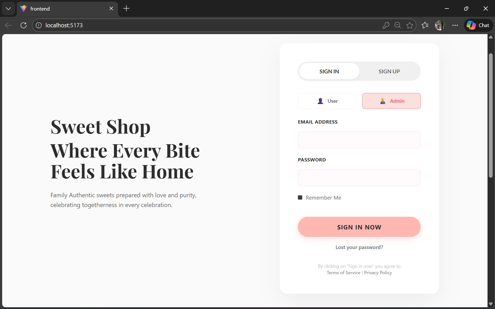
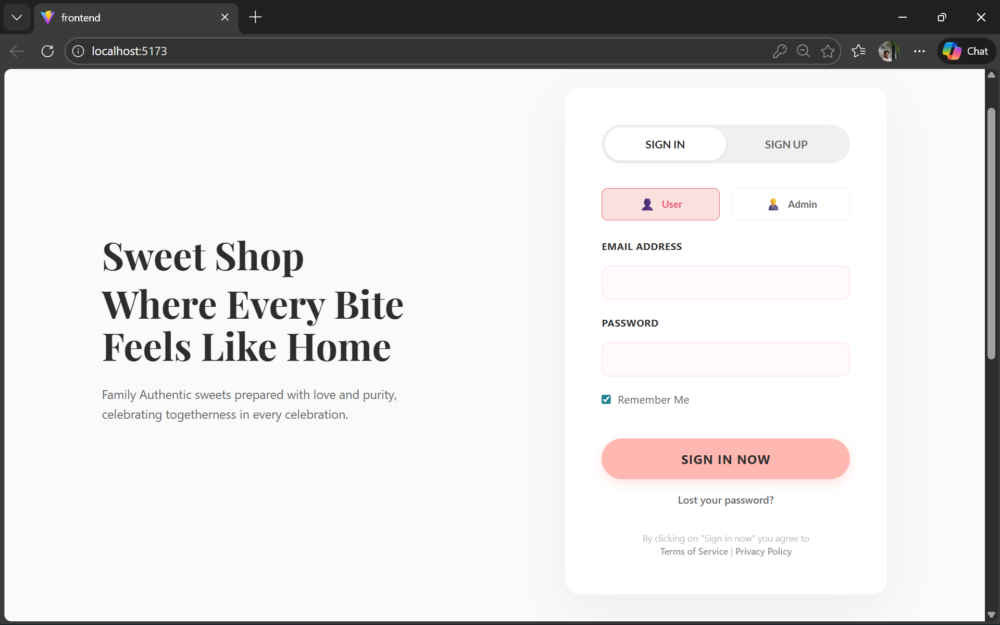
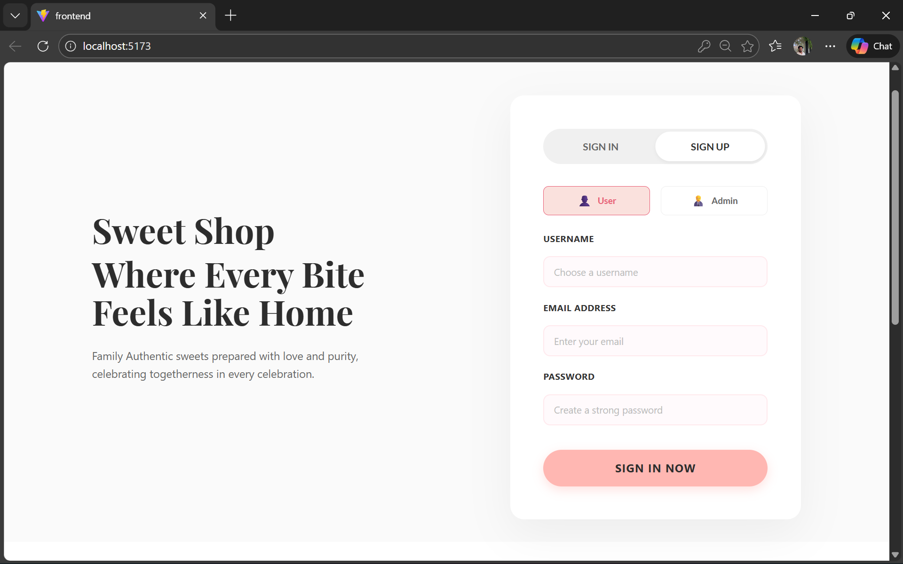
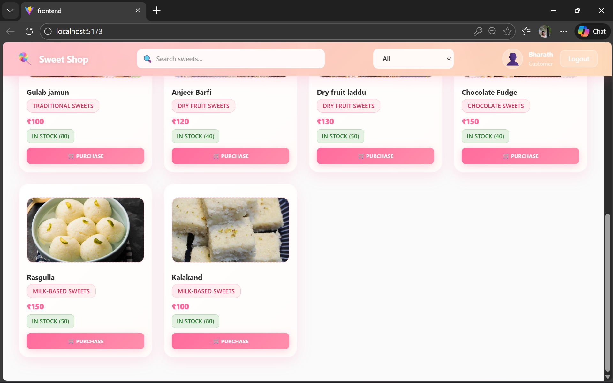
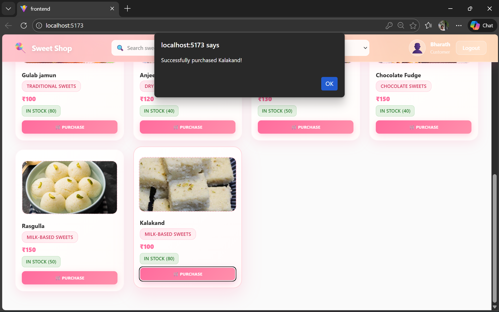
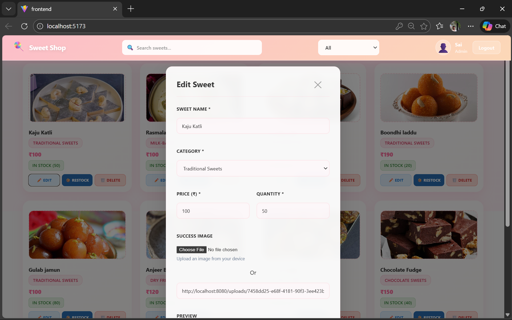
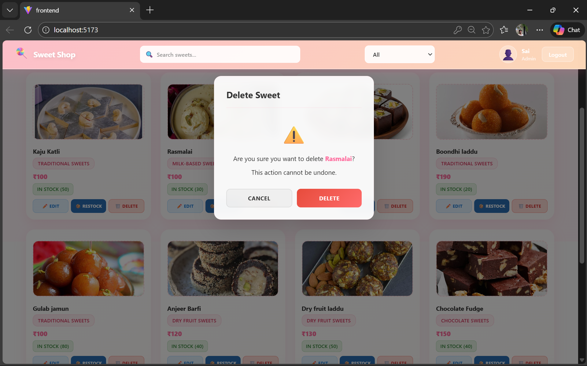
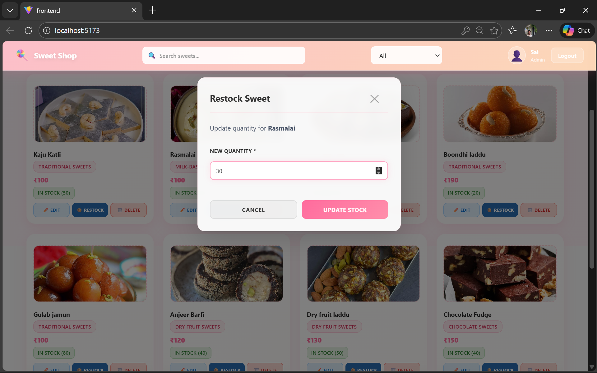

# 🍬 Sweet Shop Management System

A full-stack web application for managing a modern sweet shop, featuring **secure authentication**, **role-based access control**, and a visually appealing **“Soft Bakery” aesthetic** frontend.

---

## 🚀 Tech Stack

### Backend

* **Java 17**
* **Spring Boot 3.2.0**
* **Spring Security** (JWT Authentication)
* **Spring Data JPA** (Hibernate)
* **MySQL**
* **Maven**

### Frontend

* **React 19**
* **Vite**
* **Axios**
* **CSS3** (Custom Soft / Glass UI Themes)

---

## ✨ Key Features

* **Secure Authentication**
  User and Admin login/registration using JWT.

* **Role-Based Access Control**
  Dedicated interfaces and permissions for Admins and Customers.

* **Product Management**
  Full CRUD operations for sweets via `SweetController`.

* **Image Handling**
  Sweet image uploads using `FileUploadController`.

* **Responsive UI**
  Modern “Soft Bakery” themed design with smooth interactions.

---

## 📸 Project Screenshots

Below are real application screenshots showcasing authentication, user flows, and admin management features.

### 🔐 Home Screen

**Admin Sign In**


**Admin Sign Up**


**User Sign In**


**User Sign Up**


---


**Available Sweets**


---

### 🛒 User Dashboard & Purchase Flow
**User Screens**




** User Clicked Purchase button of  Kalakand sweet **


** Stock Value of kalakand sweet is updated **
.png)

---

### 🧑‍💼 Admin Dashboard & Sweet Management

**Admin Screens**


**Admin Sweet Operations**

**Add New Sweet**

**Edit Sweet**

**Delete Sweet**

**Restock Sweet**


---

## 📂 Project Structure

```
Sweet-Shop-Management-System
│
├── Frontend/                       # React Frontend Application
│   ├── src/                        # Components, Hooks, Styles
│   ├── public/                     # Static assets
│   └── package.json                # Frontend dependencies
│
├── Sweetbase/                      # Spring Boot Backend Application
│   ├── src/                        # Java source & resources
│   ├── pom.xml                     # Backend dependencies
│   └── start.sh                    # Startup scripts (if any)
│
├── project-screens/                # Application UI Screenshots
│   │
│   ├── Homescreen/                 # Authentication & Landing Screens
│   │   ├── user-signin.png
│   │   ├── user-signup.png
│   │   ├── admin-signin.png
│   │   ├── admin-signup.png
│   │   ├── available-sweets-1.png
│   │   └── available-sweets-2.png
│   │
│   ├── Userdashboard/              # User Dashboard & Purchase Flow
│   │   ├── userscreen-1.png
│   │   ├── userscreen-2.png
│   │   ├── onpurchaseclick-1.png
│   │   └── onpurchaseclick-2-output.png
│   │
│   └── Admindashboard/             # Admin Management Screens
│       ├── adminscreen-1.png
│       ├── adminscreen-2.png
│       ├── addnewsweet.png
│       ├── editsweet.png
│       ├── deletesweet.png
│       └── restocksweet.png
│
├── .env                            # Local environment variables (Git ignored)
├── .env.example                    # Sample environment configuration
└── README.md                       # Project documentation

```

---

## 🛠️ Prerequisites

Ensure the following are installed on your system:

* **Java JDK 17+**
* **Node.js 18+** and **npm**
* **MySQL 8.0+**

---

## ⚙️ Environment Setup

### 1️⃣ Database Configuration

Ensure MySQL is running locally.
The application can automatically create the database if configured correctly.

### 2️⃣ Environment Variables

Copy the example environment file:

```bash
cp .env.example .env
```

Update `.env` with your credentials:

```properties
SPRING_DATASOURCE_URL=jdbc:mysql://localhost:3306/sweetbase?createDatabaseIfNotExist=true
SPRING_DATASOURCE_USERNAME=root
SPRING_DATASOURCE_PASSWORD=your_password
JWT_SECRET=your_secure_random_secret_key
```

---

## 🚀 Running the Project

### Backend (Spring Boot)

```bash
cd Sweetbase
mvn spring-boot:run
```

* Server starts on **[http://localhost:8080](http://localhost:8080)**

---

### Frontend (React)

```bash
cd Frontend
npm install
npm run dev
```

* Open **[http://localhost:5173](http://localhost:5173)** in your browser

---

## 🔌 API Endpoints

| Component | Method | Endpoint         | Description                  |
| --------- | ------ | ---------------- | ---------------------------- |
| Auth      | POST   | `/auth/register` | Register a new user/admin    |
| Auth      | POST   | `/auth/login`    | Login and receive JWT        |
| Sweets    | GET    | `/api/sweets`    | Fetch all sweets             |
| Sweets    | POST   | `/api/sweets`    | Add a new sweet (Admin only) |
| Upload    | POST   | `/api/upload`    | Upload sweet images          |

---

## 🔒 Security

* **JWT Authentication** – Stateless and secure session handling
* **BCrypt Password Hashing** – Secure credential storage
* **CORS Configuration** – Allows safe frontend-backend communication

---

## 🔮 Future Improvements

* Shopping Cart & Checkout System
* Order History & Tracking
* Email Notifications for users
* Dockerization for deployment
* Payment Gateway Integration

---

## 👤 Author

**Vivek Neerumalla**
